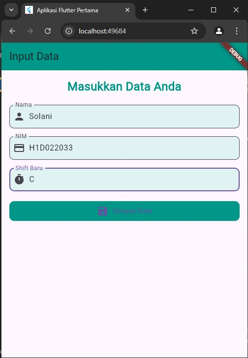
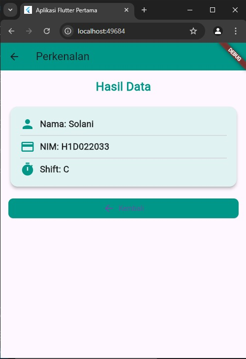

# Tugas Pertemuan 2

Nama        : SOLANI
NIM         : H1D022033
Shift Baru  : C

Proses passing data dari form menuju tampilan

1. Membuat Form Input untuk Mengambil Data
   Pada file `form_data.dart`, membuat sebuah form dengan tiga input yaitu:
   - Nama
   - NIM
   - Shift
   Untuk membuat input  menggunakan widget `TextField` dan `TextEditingController` untuk menangani input oleh pengguna.

TextEditingController berfungsi sebagai pengelola data yang dimasukkan di inputan `TextField`. Jadi, setiap input pengguna disimpan sementara di controller yang bersangkutan.
Dengan demikian, data yang diinput di form untuk Nama akan tersimpan dalam `_namaController.text`, dan sama juga dengan NIM dan Shift.

2. Mengambil Data dari Form dan Navigasi ke Halaman Lain
 Setelah pengguna mengisi data pada form, langkah selanjutnya adalah menekan tombol SIMPAN . Ketika tombol SIMPAN ditekan, aplikasi akan melakukan hal berikut:
   - Mengambil data yang telah dimasukkan dari controller.
   - Melakukan navigasi ke halaman hasil (`tampil_data.dart`) dan mempassing data tersebut.

Setelah data diambil, menggunakan `Navigator.of(context).push()` untuk pindah ke halaman tampilan hasil dengan membawa data yang sudah di inputkan. Data tersebut dipassing melalui constructor dari class `TampilData`.
Navigator.push : Digunakan untuk berpindah dari halaman form ke halaman hasil. MaterialPageRoute untuk membuat transisi halaman.
Passing Data : untuk mengirimkan variabel `nama`, `nim`, dan `shift` ke class `TampilData` sebagai parameter.

3. Menerima Data di Halaman Tampilan Hasil
 Pada halaman tampil_data.dart, class `TampilData` digunakan untuk menerima data yang dipassing dari halaman form. Proses penerimaan data ini dilakukan melalui constructor class.
 `final` variabel : Data yang dipassing dari halaman form diterima sebagai variabel `final` agar bersifat immutable dan bisa digunakan di halaman ini.
 `required` parameter: Parameter `nama`, `nim`, dan `shift` menjadi wajib saat memanggil class tersebut sehingga harus mengirim data saat navigasi.

4. Menampilkan Data di Halaman Tampilan
   Setelah data diterima, langkah selanjutnya adalah menampilkannya dalam bentuk paragraf menggunakan widget `Text`. 
   - Pada widget `Text`, memanfaatkan variabel `nama`, `nim`, dan `shift` untuk membuat kalimat paragraf yang menampilkan informasi yang telah diinput pengguna di halaman form sebelumnya.
   - Data yang ditampilkan berupa kalimat: 
     > "Nama saya [nama], NIM saya [nim], dan shift praktikum saya adalah [shift]."

Tampilan data untuk dilihat.

Nama : ___

NIM : ___

Shift Baru: ___

## Screenshot

